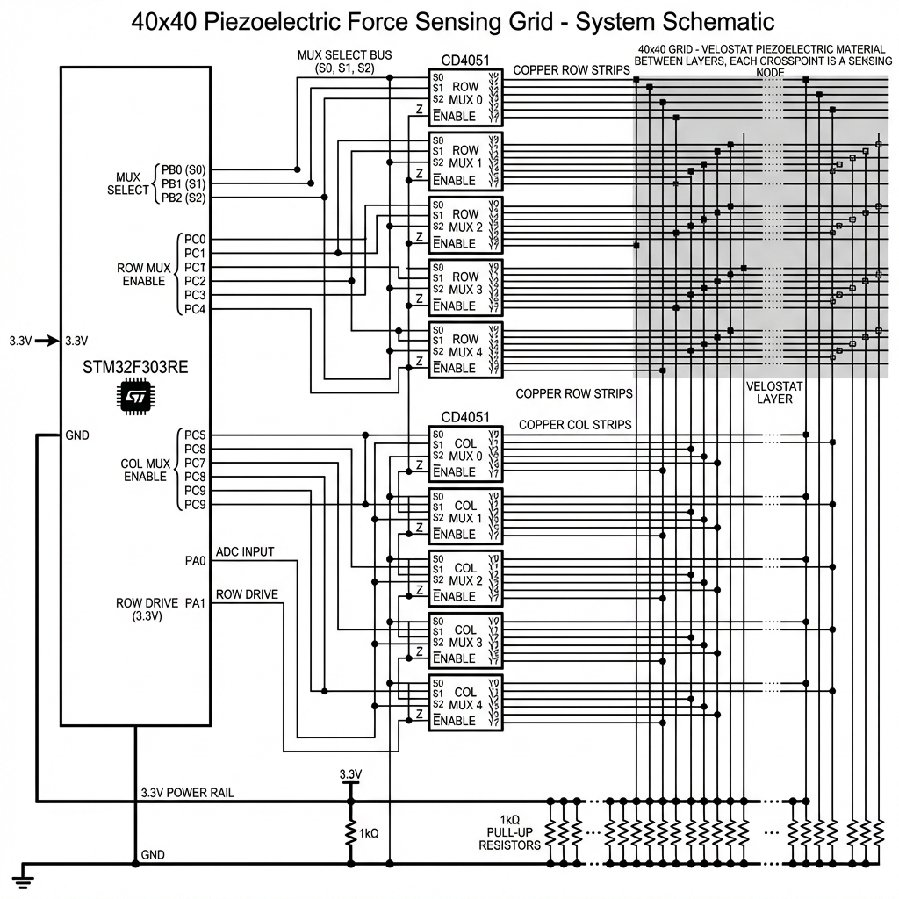
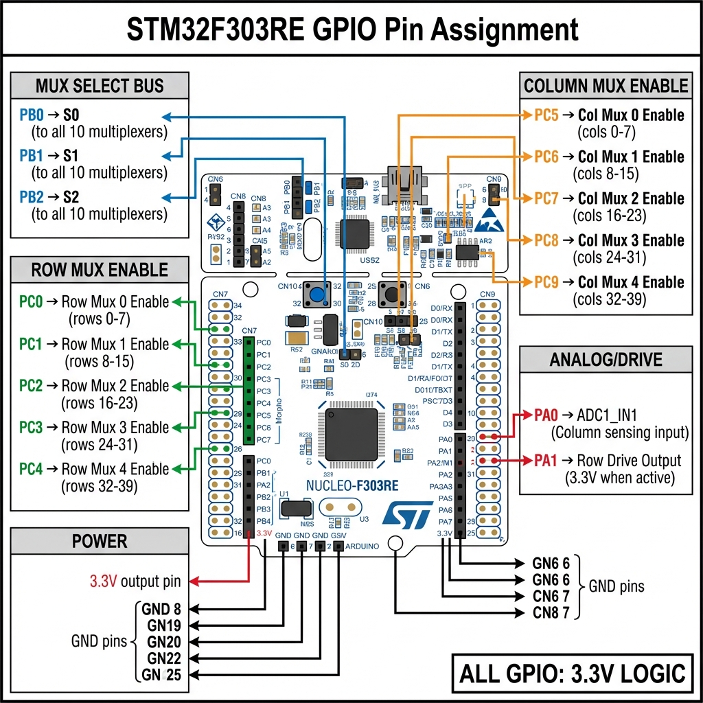
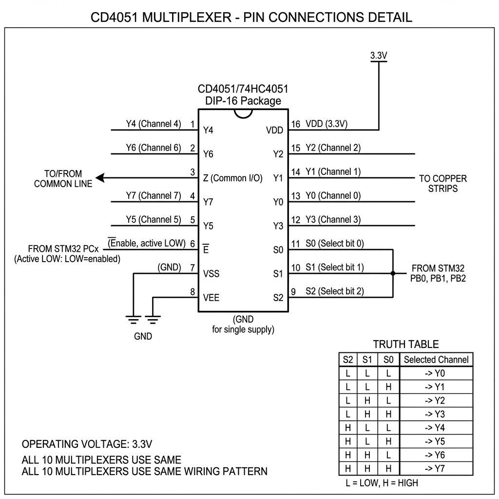
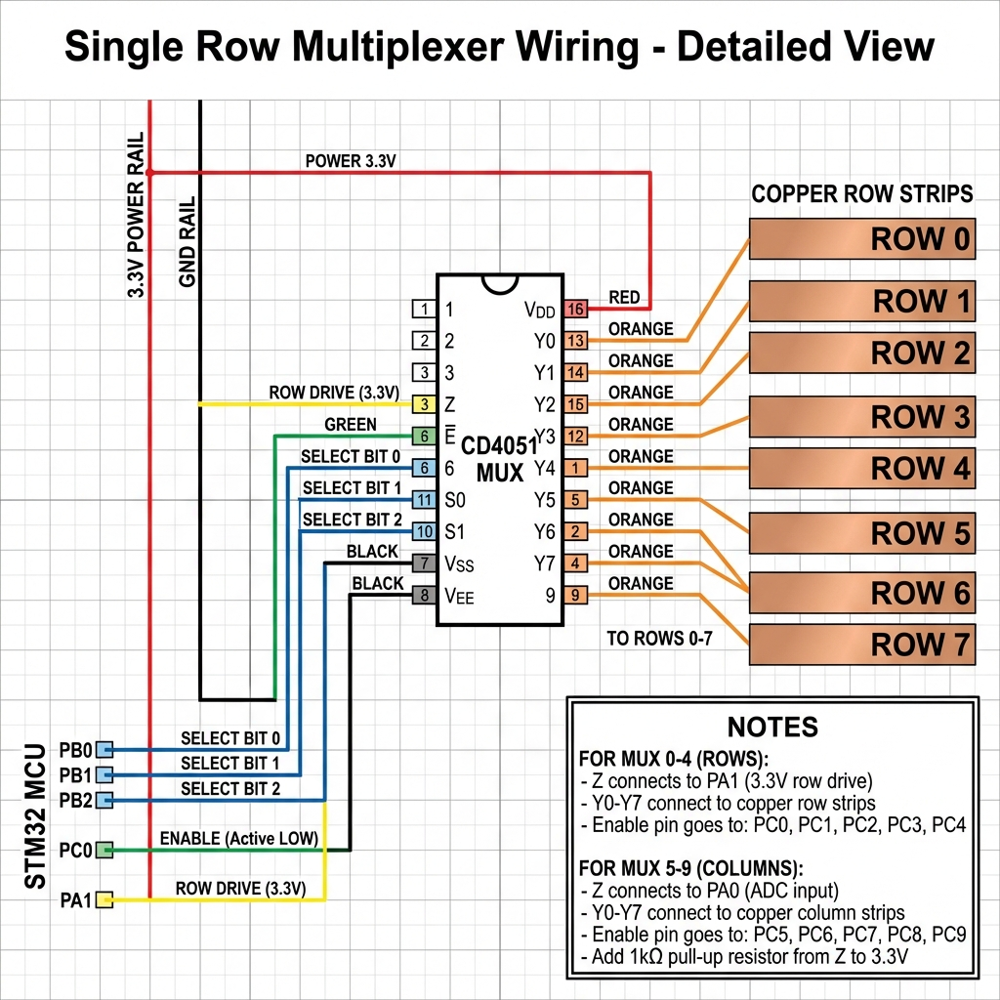
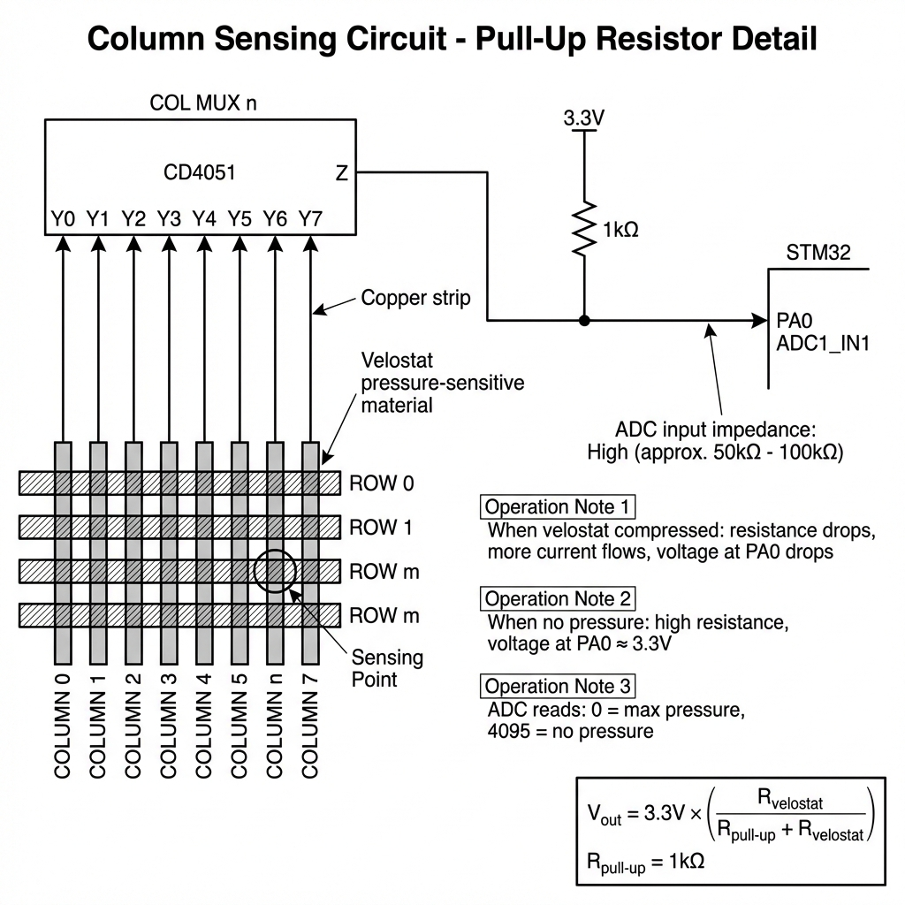

# 40×40 Piezoelectric Force Sensing Grid - Schematic Documentation

> **Project:** Physiotherapy Training System  
> **Grid Size:** 40 rows × 40 columns = 1600 sensing nodes  
> **Coverage:** 200mm × 200mm (5mm copper strip spacing)  
> **Operating Voltage:** 3.3V

---

## Table of Contents

1. [System Overview](#1-system-overview)
2. [STM32 Pin Assignment](#2-stm32-pin-assignment)
3. [CD4051 Multiplexer Pinout](#3-cd4051-multiplexer-pinout)
4. [Single Mux Wiring Detail](#4-single-mux-wiring-detail)
5. [Pull-Up Resistor Circuit](#5-pull-up-resistor-circuit)
6. [Pin Connection Table](#6-pin-connection-table)

---

## 1. System Overview



**Draw.io source:** [system_overview.drawio](system_overview.drawio)

The system uses 10 CD4051 analog multiplexers:
- **5× Row Muxes** (drive rows 0-39 via PA1)
- **5× Column Muxes** (read columns 0-39 via PA0)

All muxes share a common 3-bit select bus (PB0, PB1, PB2).

---

## 2. STM32 Pin Assignment



**Draw.io source:** [stm32_pin_assignment.drawio](stm32_pin_assignment.drawio)

### Pin Groups

| Group | Pins | Function | Color Code |
|-------|------|----------|------------|
| MUX Select | PB0, PB1, PB2 | S0, S1, S2 to all 10 muxes | Purple |
| Row Enable | PC0, PC1, PC2, PC3, PC4 | Enable Row Mux 0-4 | Green |
| Col Enable | PC5, PC6, PC7, PC8, PC9 | Enable Col Mux 0-4 | Orange |
| Analog | PA0, PA1 | ADC input, Row drive | Red |

---

## 3. CD4051 Multiplexer Pinout



**Draw.io source:** [cd4051_pinout.drawio](cd4051_pinout.drawio)

### DIP-16 Pin Reference

| Pin | Name | Function | Connection |
|-----|------|----------|------------|
| 1 | Y4 | Channel 4 | Copper strip |
| 2 | Y6 | Channel 6 | Copper strip |
| 3 | **Z** | Common I/O | PA1 (rows) or PA0 (cols) |
| 4 | Y7 | Channel 7 | Copper strip |
| 5 | Y5 | Channel 5 | Copper strip |
| 6 | **E̅** | Enable (Active LOW) | PCx pin |
| 7 | VSS | Ground | GND |
| 8 | VEE | Ground | GND |
| 9 | S2 | Select Bit 2 | PB2 |
| 10 | S1 | Select Bit 1 | PB1 |
| 11 | S0 | Select Bit 0 | PB0 |
| 12 | Y3 | Channel 3 | Copper strip |
| 13 | Y0 | Channel 0 | Copper strip |
| 14 | Y1 | Channel 1 | Copper strip |
| 15 | Y2 | Channel 2 | Copper strip |
| 16 | **VDD** | Power | 3.3V |

### Channel Select Truth Table

| S2 | S1 | S0 | Selected Channel |
|:--:|:--:|:--:|:----------------:|
| 0 | 0 | 0 | Y0 |
| 0 | 0 | 1 | Y1 |
| 0 | 1 | 0 | Y2 |
| 0 | 1 | 1 | Y3 |
| 1 | 0 | 0 | Y4 |
| 1 | 0 | 1 | Y5 |
| 1 | 1 | 0 | Y6 |
| 1 | 1 | 1 | Y7 |

---

## 4. Single Mux Wiring Detail



**Wire each CD4051 as follows:**

1. **Power (Same for all):**
   - Pin 16 (VDD) → 3.3V (RED wire)
   - Pin 7 (VSS) → GND (BLACK wire)
   - Pin 8 (VEE) → GND (BLACK wire)

2. **Select Bus (Same for all):**
   - Pin 11 (S0) → PB0 (BLUE wire)
   - Pin 10 (S1) → PB1 (BLUE wire)
   - Pin 9 (S2) → PB2 (BLUE wire)

3. **Enable (Different per mux):**

   | Mux | Pin 6 (E̅) → | Drives |
   |-----|-------------|--------|
   | Row Mux 0 | PC0 | Rows 0-7 |
   | Row Mux 1 | PC1 | Rows 8-15 |
   | Row Mux 2 | PC2 | Rows 16-23 |
   | Row Mux 3 | PC3 | Rows 24-31 |
   | Row Mux 4 | PC4 | Rows 32-39 |
   | Col Mux 0 | PC5 | Cols 0-7 |
   | Col Mux 1 | PC6 | Cols 8-15 |
   | Col Mux 2 | PC7 | Cols 16-23 |
   | Col Mux 3 | PC8 | Cols 24-31 |
   | Col Mux 4 | PC9 | Cols 32-39 |

4. **Z Pin Connection:**
   - Row Muxes: Pin 3 (Z) → PA1 (all 5 joined)
   - Col Muxes: Pin 3 (Z) → PA0 (all 5 joined)

---

## 5. Pull-Up Resistor Circuit



**Draw.io source:** [pullup_circuit.drawio](pullup_circuit.drawio)

### Circuit

```
        3.3V
          │
         [1kΩ]  ← Pull-up resistor
          │
          ├──────────── PA0 (ADC input)
          │
    Z─────┴───── Col Mux Z outputs (all 5 connected)
```

### Operating Principle

| Condition | Velostat Resistance | Voltage at PA0 | ADC Value |
|-----------|---------------------|----------------|-----------|
| No pressure | High (~∞) | ~3.3V | ~4095 |
| Light pressure | Medium | ~1.5-2.5V | ~2000-3000 |
| Max pressure | Low (~0) | ~0V | ~0 |

**Formula:** `V_out = 3.3V × (R_velostat / (1kΩ + R_velostat))`

---

## 6. Pin Connection Table

### Complete Wiring Summary

| STM32 Pin | Function | Connects To |
|-----------|----------|-------------|
| **PB0** | MUX Select S0 | Pin 11 of ALL 10 muxes |
| **PB1** | MUX Select S1 | Pin 10 of ALL 10 muxes |
| **PB2** | MUX Select S2 | Pin 9 of ALL 10 muxes |
| **PC0** | Row Mux 0 Enable | Pin 6 of Row Mux 0 |
| **PC1** | Row Mux 1 Enable | Pin 6 of Row Mux 1 |
| **PC2** | Row Mux 2 Enable | Pin 6 of Row Mux 2 |
| **PC3** | Row Mux 3 Enable | Pin 6 of Row Mux 3 |
| **PC4** | Row Mux 4 Enable | Pin 6 of Row Mux 4 |
| **PC5** | Col Mux 0 Enable | Pin 6 of Col Mux 0 |
| **PC6** | Col Mux 1 Enable | Pin 6 of Col Mux 1 |
| **PC7** | Col Mux 2 Enable | Pin 6 of Col Mux 2 |
| **PC8** | Col Mux 3 Enable | Pin 6 of Col Mux 3 |
| **PC9** | Col Mux 4 Enable | Pin 6 of Col Mux 4 |
| **PA0** | ADC Input | Z pins of all 5 col muxes (via 1kΩ pull-up) |
| **PA1** | Row Drive | Z pins of all 5 row muxes |
| **3.3V** | Power | VDD (Pin 16) of ALL 10 muxes |
| **GND** | Ground | VSS+VEE (Pins 7,8) of ALL 10 muxes |

---

## Wire Color Guide (Suggested)

| Signal | Wire Color |
|--------|------------|
| 3.3V Power | RED |
| Ground | BLACK |
| Select S0/S1/S2 | BLUE |
| Row Enables | GREEN |
| Col Enables | ORANGE |
| Row Drive (PA1) | YELLOW |
| ADC Input (PA0) | WHITE |
